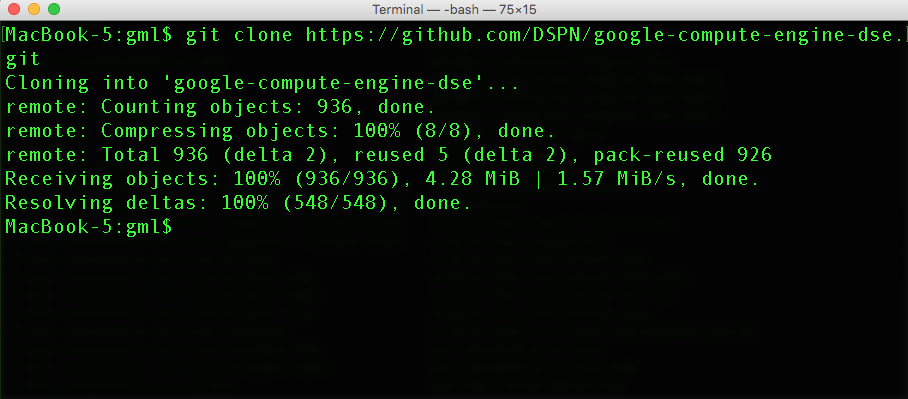
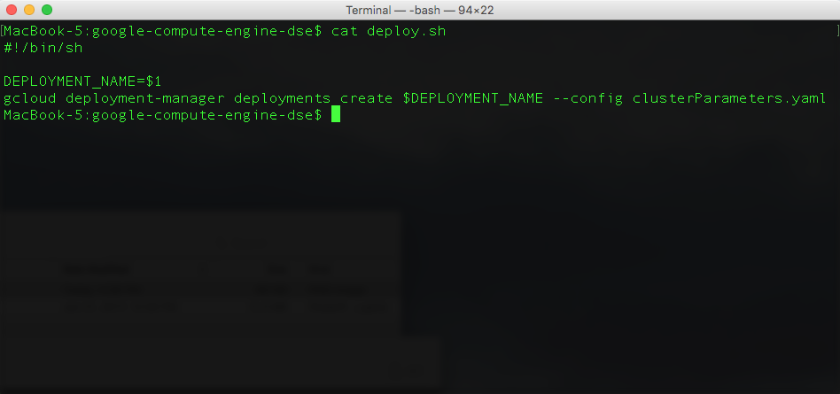
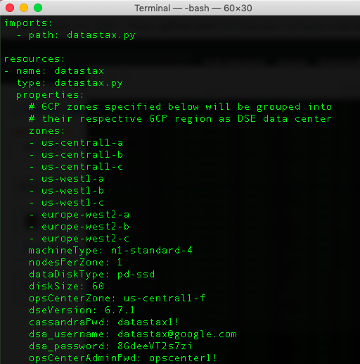
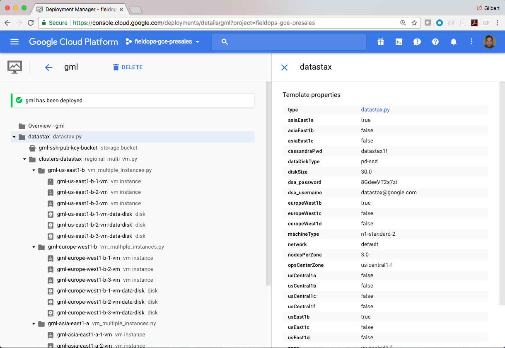
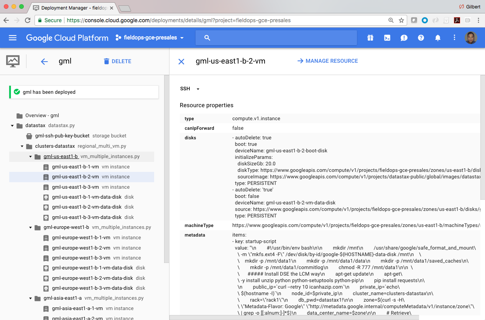
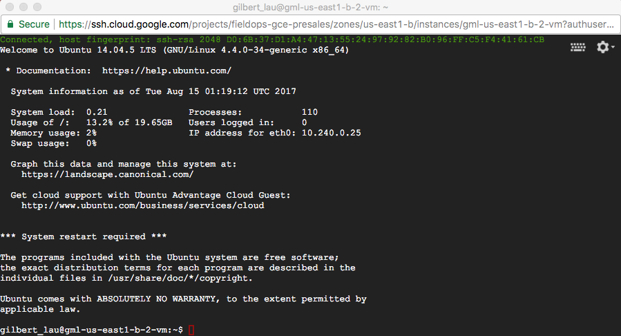

# google-compute-engine-dse

This is a Google Deployment Manager template for Google Compute Engine (GCE) that will deploy a single or multiple datacenter cluster.  deploy.sh is the main entry point.  The clusterParameters.* files give some example configurations.

The [DataStax Enterprise Deployment Guide for Google](https://github.com/DSPN/google-deployment-guide) provides background on best practices in Google Cloud Platform (GCP) as well as instructions on using Google Cloud Launcher.  Cloud Launcher is Google's graphical tool for creating deployments.  This template is used in our Cloud Launcher deployment.

## Disclaimer
The use of this repo is intended for development purpose only.  Usage of this repo is solely at user’s own risks.  There is no SLAs around any issues posted on this repo.  Internal prioritization of repo issues will be processed by the owners of this repo periodically.  There is no association with any technical support subscription from DataStax.

The use of DataStax software is free in development. Deploying and running DataStax software on a cloud provider will incur costs associated with the underlying cloud provider’s resources such as compute, network and storage, etc.  Please refer to your cloud provider for effective cloud resources pricing.

## Licensing Terms
This Google Cloud Deployment Manager solution to deploy DataStax Enterprise on Google Compute Engine (GCE) includes a limited no-fee license from DataStax. As described in section 1.4 of [DataStax Enterprise Terms](https://www.datastax.com/enterprise-terms), the limited license is for development or non-production use.

# Deploying to Google Cloud Platform (GCP)

## Set up GCP Prerequisites

To use these templates, you will need to register for a GCP account.  Google offers a free trial for new users.  You will also need to install the Cloud SDK locally or use the Google Cloud Shell.  In these instruction we use a local install of the Cloud SDK.  More information is available at:
* https://cloud.google.com/sdk/
* https://cloud.google.com/shell/docs/

If you haven't already, you will also need to create a GCP project.  That can be accomplished in the Google Cloud Console here: https://console.cloud.google.com/ 

After creating the project, set it as the default project that gcloud will use with the command:

    gcloud config set project <myproject>

## Clone and Investigate the Template Repo

Now that you have the gcloud tools installed, you’ll want to clone a copy of the template repo.  The GCE repo is here: https://github.com/DSPN/google-compute-engine-dse

To clone it use the command:

    git clone https://github.com/DSPN/google-compute-engine-dse.git

If all went well, output should look something like this:

Now cd into the repo directory and list files there using the commands:

    clear
    cd google-compute-engine-dse
    ls

Our main entry point is a file called deploy.sh. We can inspect that file using the commands:

    clear
    cat deploy.sh

This is an extremely simple shell script that invokes the Google Cloud SDK. It takes one argument, the name of the deployment. The deployment name needs to be unique within your project. The deploy.sh script also depends on the input file clusterParameters.yaml. This file defines our cluster topology. Let’s take a quick look with the following commands:

    clear
    cat clusterParameters.yaml

This config is going to create 3 nodes in each of 3 different regions, for a total of 9 nodes. Each node is a very small machine, an n1-standard-2. This isn’t a size we’d recommend for production use but is fine for testing out a deployment. Similarly, each node will be configured with a 60GB pd-ssd.  This is an extremely small disk but will be sufficient for our test deployment.

You can choose DataStax Enterprise version 5.1.7 or version 6.0.0 for your deployment. It is defined in the **dseVersion** field.

Specifically, you can either use our default password `datastax1!` for the "cassandra" user or choose your own password by updating the value of the `cassandraPwd` field.  You will need to provide your DataStax Academy username and password for the `dsa_username` and `dsa_password` fields respectively in order to execute your template.  If you do not have an account at academy.datastax.com, you can create one now.  It is free!

There is also a field named opsCenterAdminPwd to define a custom password for OpsCenter's Username: "admin".  It has been defaulted to "opscenter1!" in our sample clusterParameters.yaml template.  

Two additional example config files are provided, clusterParameters.small.yaml and clusterParameters.large.yaml. The large one creates nodes in every Google zone currently available. You may need to request your core quotas be increased to run it.

We encourage you to look at the templates more and better understand what they’re doing. They are provided to get you started and we fully expect you to customize them in ways that suit your needs.

Now that we’ve had a look through the project, let’s try running it!

## Create a Deployment

We’re going to start off by creating a new deployment. I’m going to call mine `gml`. To create it, I’m going to enter the command:

    clear
    ./deploy.sh gml

Once that completes, I see the following output:

At this point, the physical resources on GCE have all provisioned. DataStax Enterprise OpsCenter LifeCycle Manager (LCM) will continue provisioning DSE nodes. That will typically take additional 20 minutes or more to deploy a 9-node DSE cluster spanning 3 GCE zones. The actual deployment time is subject to the size of your cluster.

## Inspecting the Cluster

To view OpsCenter, the DataStax admin interface, we will need to create an ssh tunnel.  To do that, open a terminal on your local machine and run the command:

    gcloud compute ssh --ssh-flag=-L8443:localhost:8443 --project=<NAME OF YOUR PROJECT> --zone=us-central1-f <NAME OF YOUR DEPLOYMENT>-opscenter-vm 

In my case, the project is named `fieldops-gce-presales` and the deployment is named `gml`, though it will have a different name for you.

Now, we can open a web browser to https://localhost:8443 and log into OpsCenter using "admin" as Username and the value of opsCenterAdminPwd in clusterParameters.yaml as Password. *The OpsCenter instance uses a self-signed SSL certificate, so you will need to accept the certificate exception before you can see the OpsCenter's login page.* 

Great!  You now have a DataStax Enterprise cluster running with 3 nodes in Asia, Europe and America.

We can also log into a node to interact with the database.  To do that go back to the Google Cloud console.

Click on any node.  In DataStax Enterprise the nodes are homogeneous so we can interact with any one.

We can connect to that node by clicking "SSH."  This will open an SSH window.

At this point we can clear the terminal window and start up cqlsh, the command line interface to DataStax Enterprise.

    clear
    cqlsh -u cassandra -p datastax1!

From there you can issue any valid cql command.  For instance:

    desc keyspaces
    

    
## Deleting a Deployment

Deployments can be deleted via the command line or the web UI. To use the command line type the command:

    gcloud deployment-manager deployments delete gml

## Next Steps

If you want to learn more about DataStax Enterprise, the online training courses at https://academy.datastax.com/ are a great place to start.

To learn more about running DataStax Enterprise on GCP take a look at the [best practices guide](bestpractices.md) and [post deploy steps](postdeploy.md).
